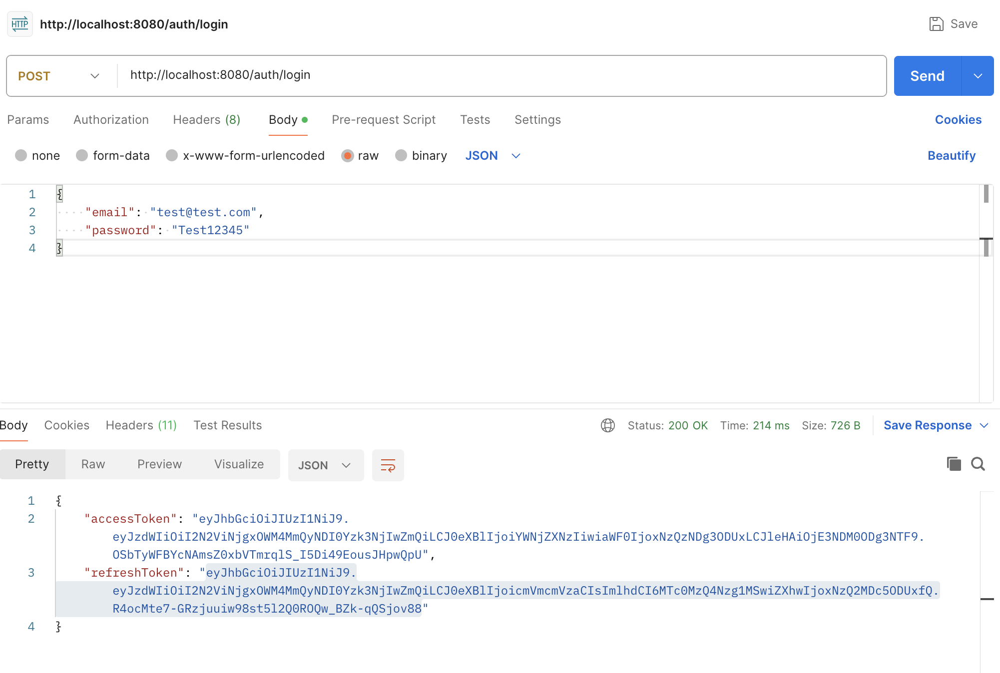
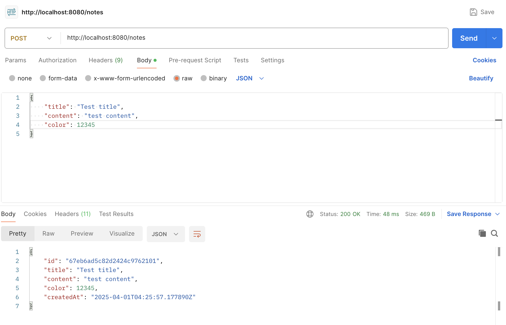
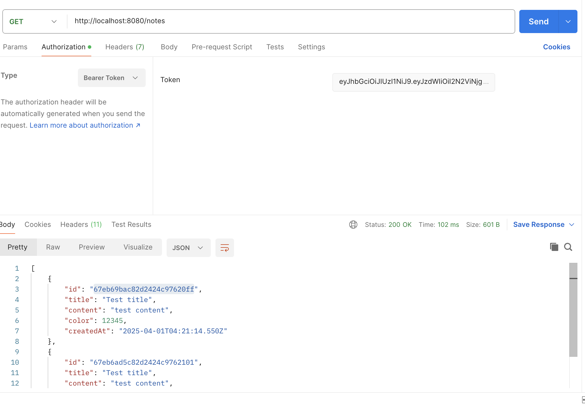
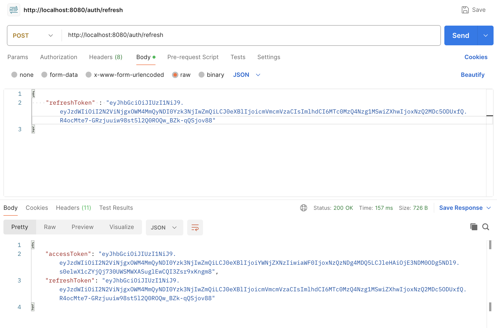

# Notes App Backend (Spring Boot, Kotlin, JWT Auth, MongoDB)

This is the backend for a simple notes application, built with Spring Boot, Kotlin, JWT authentication, and MongoDB.

## Features

* **User Authentication:**
    * User registration and login.
    * JWT-based authentication for secure API access.
* **Note Management:**
    * Create, read, update, and delete notes.
    * Notes are associated with specific users.
    * Notes have a title, content, color, and creation date.
* **MongoDB Integration:**
    * Data persistence using MongoDB.
* **RESTful API:**
    * Provides a RESTful API for interacting with the application.

## Technologies Used

* **Spring Boot:** Framework for building Java/Kotlin applications.
* **Kotlin:** Programming language.
* **JWT (JSON Web Tokens):** For secure authentication.
* **MongoDB:** NoSQL database.
* **Gradle (Kotlin DSL):** Build tool.

**API Endpoints:**

    * **User Authentication:**
        * `POST /auth/register`: Register a new user.
        * `POST /auth/login`: Login and get a JWT.
        * `POST /auth/refresh`: Refresh a JWT using a refresh token.
    * **Notes:**
        * `POST /notes`: Create a new note.
        * `GET /notes: Get notes by user ID.
        * `DELETE /notes/{id}`: Delete a note.

**Screenshots:**

